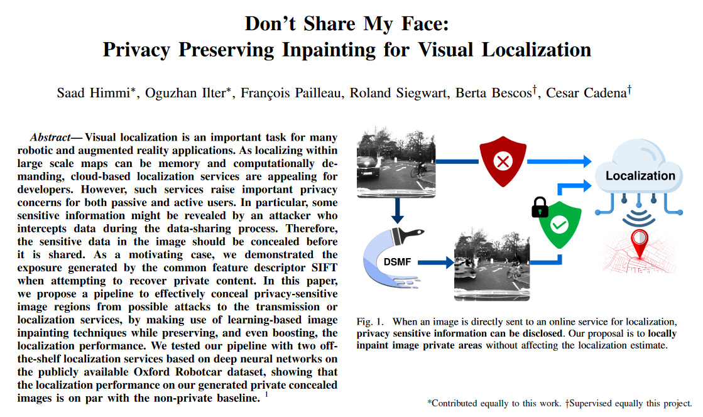

# Dont-Share-My-Face
Privacy Preserving Inpainting for Visual Localization. The paper of the project was accepted to [International Conference on Intelligent Robots and Systems (IROS) 2022](https://iros2022.org/).

# Authors
Saad Himmi*, Oguzhan Ilter*, François Pailleau, Roland Siegwart, Berta Bescos^, Cesar Cadena^

*Contributed equally to this work. 
^Supervised equally this project.

# Abstract 

# Availability 
The source code will be made publicly available as soon as the paper is published in [IROS 2022](https://iros2022.org/).

